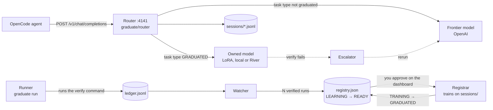

# GRADUATE

**GRADUATE is a drop-in router that sits between your coding agent and the frontier model and watches the work.** Every agent session runs through it, and a verify command (usually the test suite) decides whether the session succeeded: exit code 0 is the only label, so nobody annotates anything. Once a task type has N verified runs, GRADUATE shows you exactly what it would train on, and after you approve it trains a small model you own on those sessions and routes that task type to it. The frontier model stays on as the fallback: every owned session is verified, and a failure escalates to the frontier, which reruns the task.

Built at the Own Your Intelligence Hackathon (YC, 2026-09-27). See [Hackathon context](#hackathon-context).

## How it works



| Piece | Code | Job |
|---|---|---|
| Router | [`graduate/router/`](graduate/router/) | OpenAI-compatible proxy; logs every session; picks frontier or owned per task type; serves the dashboard |
| Runner | [`graduate/runner/`](graduate/runner/) | Runs one task through OpenCode, then the verify command; writes a ledger row |
| Watcher | [`graduate/watcher/`](graduate/watcher/) | Counts verified runs per task type; LEARNING → READY |
| Registrar | [`graduate/registrar/`](graduate/registrar/) | Builds the training records, LoRA-trains the owned model; TRAINING → GRADUATED |
| Escalator | [`graduate/escalator/`](graduate/escalator/) | A failed owned session is rerun on the frontier; the failed row stays in the ledger |
| Dashboard | [`ui/index.html`](ui/index.html) | One HTML file, no build step: task types, consent screen, and "Under the hood" |

Every shape that crosses a component boundary is defined in [`graduate/contracts.md`](graduate/contracts.md).

## Quickstart: the dashboard in 30 seconds, no key

The repo is private, so these installs work for collaborators with GitHub access only.

```bash
uvx --from git+https://github.com/ayaangazali/jelly graduate up --demo
```

Open http://localhost:4141/ for the dashboard on fixture data; Ctrl-C stops it.

Or in Docker, from a clone: `docker build -t graduate . && docker run --rm -p 4141:4141 graduate`.

`graduate up` always binds port 4141 and refuses to start if it is taken. The numbers in `--demo` are fixtures, and the dashboard labels them as sample data.

## Run a real task

Needs Python 3.11+, an OpenAI key and [OpenCode](https://opencode.ai) (`curl -fsSL https://opencode.ai/install | bash`).

```bash
git clone https://github.com/ayaangazali/jelly && cd jelly
python3 -m venv .venv && . .venv/bin/activate
pip install -e '.[test]'
graduate init
graduate up
```

`graduate init` checks Python and OpenCode, asks for `OPENAI_API_KEY` and writes `.env`, `prices.json`, `registry.json` and the `graduate` provider in `opencode.json`. `graduate up` starts the router and watcher on :4141 with the dashboard at http://localhost:4141/; leave it running.

In a second terminal, from the same directory:

```bash
. .venv/bin/activate
scripts/reset-demo.sh 01
graduate run --task-file demo-repo/tasks/01.json --repo demo-repo
```

`reset-demo.sh 01` plants a failing test in `demo-repo/`. OpenCode fixes the test through the router, the verify command runs, and a ledger row lands on the dashboard. `graduate --help` lists the other commands (`bench`, `results`, `train`).

Training the owned model needs the `[train]` extra (`pip install -e '.[test,train]'`, Python 3.12+). The owned backend is `river` if `RIVER_API_KEY` is set, else `local` (CPU, torch + peft) if they import, else `none`. See [`docs/pretrained-model.md`](docs/pretrained-model.md).

| Missing | What still works |
|---|---|
| OpenAI key | `graduate up --demo` only: the dashboard on fixture data |
| River key | Training runs locally (`local`), or nothing graduates (`none`); everything routes to the frontier meanwhile |
| OpenCode | Dashboard and router; `graduate run` needs it |
| `[train]` extra | Runs, the router and the dashboard; building training records and `scripts/demo.sh` stop and ask for it |

## The offline demo: the whole story, $0

```bash
pip install -e '.[test,train]'
scripts/demo.sh --offline --auto-approve --use-checkpoint <path-to-checkpoint>
```

`--offline` points the router at [`scripts/stub-upstream.py`](scripts/stub-upstream.py), a scripted stand-in for OpenAI, so zero OpenAI calls are made. The script restores a 4-of-5 ledger, runs broken state 05 on the frontier (READY), approves, graduates, runs broken state 07 (a repeat of training data) and 09 (never seen) on the owned model, and shows a failure escalating to the frontier (forced on state 10 if 09 passes). Without `--use-checkpoint` it waits for the live training job. CI passes `--use-checkpoint river://run-ci/sampler_weights/fix-failing-test-v1`: with no River key there, step 5 shows the fall-back to the frontier. A local LoRA checkpoint (see [`docs/pretrained-model.md`](docs/pretrained-model.md)) runs the owned model for real on CPU. `PORT=42xx` moves it off 4141. Without `--auto-approve` you click Approve on the dashboard.

**Offline numbers are stub numbers.** The frontier's tokens and cost are made up, so an offline run proves the plumbing, not savings. The script says so in the table it writes to [`docs/results.md`](docs/results.md).

## Test it

```bash
pip install -e '.[test,train]'
make check && make test
make e2e-replay
```

The `[train]` extra needs Python 3.12+, because `make check`'s dataset self-check imports river-client. `make check` imports every module and runs the self-checks; `make test` is pytest, fully offline (the frontier is the `stub` fixture in `tests/conftest.py`). `make e2e-replay` drives real OpenCode and the demo repo's pytest against the stub upstream: about a minute, $0.

CI ([`.github/workflows/ci.yml`](.github/workflows/ci.yml)) runs all three, plus `scripts/demo.sh --offline` from a clean checkout. On macOS one test, `test_live_sh_refuses_without_credit_before_touching_anything`, fails because `scripts/live.sh` uses GNU-only `realpath -m` (#120); CI on Linux is green. Manual QA for humans: [`docs/QA.md`](docs/QA.md).

## Status: what is proven

From the 2026-09-27 test run (real OpenAI, gpt-5-mini, spend-capped, $0.02 total):

| Claim | Verdict |
|---|---|
| Records and verifies agent sessions through the proxy | **Proven, real OpenAI**: 3 real gpt-5-mini sessions, exit 0 |
| Counts verified runs and flips the task type to READY | **Proven, real**: READY at N=3 |
| Consent shows exactly what will be trained, and where | **Proven, real**: 3 records, 51,762 tokens, "this machine" |
| Trains a small model you own | **Proven, real data**: Qwen2.5-Coder-0.5B, 15 steps, loss 1.05 → 0.088, 76.6 s |
| Routes the task type to it | **Proven**: session logs show `upstream: owned` |
| The small model fixes new instances by itself | **Partly**: trained on the 3 real sessions (states 01–03), it fixed **1 of 7** unseen states (04–10). The stub-trained checkpoint passed 5 of 7, but all 5 were in its training data, and it failed both held-out states, 09 and 10 (#117) |
| With fewer turns / lower cost than the frontier | **Not proven** (#118) |
| Escalates on failure and keeps the failed row | **Proven** (the mechanism) |
| Quality never drops | **Not provable offline**; live escalations were blocked by the OpenAI free-tier daily cap (#114) |

Checkpoints are trained on demo broken states 01–08, so an owned pass on 01–08 is a repeat, not a held-out result; 09 and 10 are held out. Runs against the stub frontier are plumbing, not results. The latest numbers and their caveats: [`docs/results.md`](docs/results.md).

## Repo layout

| Path | What |
|---|---|
| [`graduate/`](graduate/) | The Python package: router, runner, watcher, registrar, escalator, CLI (`graduate/cli.py`) |
| [`ui/`](ui/) | The dashboard the router serves |
| [`demo-repo/`](demo-repo/) | The stage: a tiny package with 10 broken states and one task type, `fix-failing-test` ([`docs/demo-repo.md`](docs/demo-repo.md)) |
| [`scripts/`](scripts/) | `demo.sh`, `stub-upstream.py`, `reset-demo.sh`, `live.sh`, corpus and recording tools |
| [`tests/`](tests/) | pytest, fully offline |
| [`fixtures/`](fixtures/) | Example records for every contract; `graduate up --demo` serves them |
| [`mock-up/`](mock-up/) | The original clickable mock-up the dashboard was built from; its diagram ids are the trace ids |
| [`docs/`](docs/) | Brief, results, QA, per-sponsor notes and research; screenshots in `docs/screens/` |
| [`SUBMISSION.md`](SUBMISSION.md) | The hackathon submission |
| `01-context/` … `04-appendix/` | The pre-event project pack (below) |

A proposal for a tidier tree, with every reference each move would break: [`docs/LAYOUT-PROPOSAL.md`](docs/LAYOUT-PROPOSAL.md).

## Contributing

Read [`AGENTS.md`](AGENTS.md) first: how to pick and claim an issue, branch naming, file ownership, the decided stack and the honesty rules. Then [`docs/PROJECT-BRIEF.md`](docs/PROJECT-BRIEF.md), which overrides the pre-event pack wherever they disagree, and [`graduate/contracts.md`](graduate/contracts.md). The pinned issue #1 is the tracker.

| Doc | What |
|---|---|
| [`docs/PROJECT-BRIEF.md`](docs/PROJECT-BRIEF.md) | What we're building, feasibility, how each sponsor fits |
| [`docs/results.md`](docs/results.md) | Measured results and their caveats |
| [`docs/pretrained-model.md`](docs/pretrained-model.md) | The owned model: base, training, serving |
| [`docs/corpus.md`](docs/corpus.md) | The staged training corpus |
| [`docs/QA.md`](docs/QA.md) | Manual QA walkthrough, $0 |
| [`docs/river-api.md`](docs/river-api.md), [`docs/river-rl.md`](docs/river-rl.md) | River training API notes; the exit-code RL spike |
| [`docs/memorable-shapes.md`](docs/memorable-shapes.md), [`docs/qm-config.md`](docs/qm-config.md) | Memorable output shapes; QM as a harness |
| [`docs/research/`](docs/research/) | The research behind the decided stack |

## Hackathon context

Own Your Intelligence Hackathon, hosted by River AI, GBrain, Memorable, QM, Superset and UFO. San Francisco, Sunday 2026-09-27: hacking 1:15–5:00pm, judging 5:00–5:45pm. Builder: Ayaan Gazali, 42nights.

The idea merges two from the brainstorm: **Graduate** (distill repeated, verified agent work into an owned small model and route to it) and **Exit Code RL** (the verify command's exit code as the reward). Harvey did this by hand and reported cost per query down ~90% ([`04-appendix/sources.md`](04-appendix/sources.md)); those are Harvey's numbers, not ours.

The pre-event project pack, written before the build. Every file has YAML frontmatter with a `purpose` and `related` links.

| Folder | Contents |
|---|---|
| [`01-context/`](01-context/) | [Event brief](01-context/event-brief.md), [sponsor stack](01-context/sponsor-stack.md) |
| [`02-project/`](02-project/) | [Spec](02-project/graduate-spec.md), [narrative](02-project/narrative.md), [architecture](02-project/architecture.md), [integration playbook](02-project/integration-playbook.md), [cost model](02-project/cost-model.md) |
| [`03-build/`](03-build/) | [Pre-event checklist](03-build/pre-event-checklist.md), [hour-by-hour plan](03-build/hour-by-hour.md), [demo script](03-build/demo-script.md), [risks](03-build/risks.md) |
| [`04-appendix/`](04-appendix/) | [Idea backlog](04-appendix/idea-backlog.md), [other deep dives](04-appendix/other-deep-dives.md), [questions for sponsors](04-appendix/questions-for-sponsors.md), [sources](04-appendix/sources.md) |

Things we never say: that a model was RL-trained in four hours, that the output is lossless (it is verifier-gated), or that any of this is free (training has an upfront cost). Details in [`03-build/risks.md`](03-build/risks.md).
