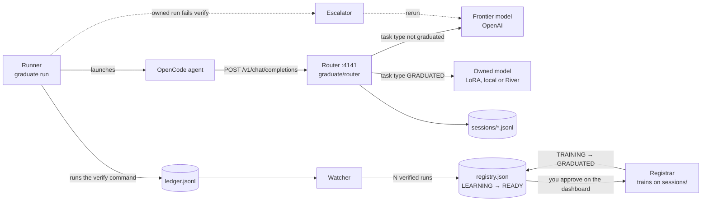

# GRADUATE

**Your agent's repeated, verified work becomes a small model you own, and the frontier model stays on as the fallback.**

1. **Watch.** A drop-in router sits between your coding agent and the frontier model and logs every session.
2. **Verify.** After each session the verify command (usually the test suite) runs. Exit code 0 is the only label, so nobody annotates anything.
3. **Graduate.** Once a task type has N verified runs, you see exactly what would be trained. You approve, a small model is trained on those sessions, and the task type routes to it. An owned session that fails verification is rerun on the frontier.

Built at the Own Your Intelligence Hackathon (YC, 2026-09-27). See [Hackathon context](#hackathon-context).

## How it works



| Piece | Code | Job |
|---|---|---|
| Router | [`graduate/router/`](graduate/router/) | OpenAI-compatible proxy; logs every session; picks frontier or owned per task type; serves the dashboard |
| Runner | [`graduate/runner/`](graduate/runner/) | Runs one task through OpenCode, then the verify command; writes a ledger row |
| Watcher | [`graduate/watcher/`](graduate/watcher/) | Counts verified runs per task type; LEARNING → READY |
| Registrar | [`graduate/registrar/`](graduate/registrar/) | Builds the training records, LoRA-trains the owned model; TRAINING → GRADUATED |
| Escalator | [`graduate/escalator/`](graduate/escalator/) | Reruns a failed owned session on the frontier; the failed row stays in the ledger |
| Sponsor hooks | [`graduate/memorable/`](graduate/memorable/), [`gbrain.py`](graduate/gbrain.py), [`mcp.py`](graduate/mcp.py) | Memorable names task types and ingests verified runs; GBrain records each graduation; an MCP server exposes the state |
| Dashboard | [`ui/index.html`](ui/index.html) | One HTML file, no build step: task types, the consent screen, and "Under the hood" |

Every shape that crosses a component boundary is defined in [`graduate/contracts.md`](graduate/contracts.md).

## Status: what is proven

These results come from the 2026-09-27 test run. Rows marked *real* used real OpenAI calls to gpt-5-mini, capped at a spending limit ($0.02 in total). The other rows come from offline runs against the stub frontier.

| Claim | Verdict |
|---|---|
| Records and verifies agent sessions through the proxy | **Proven, real**: 3 gpt-5-mini sessions, exit 0 |
| Counts verified runs and flips the task type to READY | **Proven, real**: READY at N=3 |
| Consent shows exactly what will be trained, and where | **Proven, real**: 3 records, 51,762 tokens, "this machine" |
| Trains a small model you own | **Proven, real data**: Qwen2.5-Coder-0.5B, 15 steps, loss 1.05 → 0.088, 76.6 s |
| Routes the task type to it | **Proven**: session logs show `upstream: owned` |
| The small model fixes new instances by itself | **Partly**: trained on the 3 real sessions (states 01–03), it fixed **1 of 7** unseen states (04–10). The stub-trained checkpoint passed 5 of 7, but all 5 were in its training data, and it failed both held-out states, 09 and 10 (#117) |
| With fewer turns / lower cost than the frontier | **Not proven** (#118) |
| Escalates on failure and keeps the failed row | **Proven offline**, stub frontier (the mechanism); live escalations hit the daily cap |
| Quality never drops | **Not provable offline**; live escalations were blocked by the OpenAI free-tier daily cap (#114) |

The stub-trained checkpoints (v1–v3) are trained on broken states 01–08, so their passes on 01–08 are repeats, not held-out results; only 09 and 10 are held out. Runs against the stub frontier show the system working end to end, but their numbers are not results. Latest numbers and caveats: [`docs/results.md`](docs/results.md).

## Quickstart: the dashboard in 30 seconds, no key

The repo is private, so these installs only work for collaborators with GitHub access.

```bash
uvx --from git+https://github.com/ayaangazali/jelly graduate up --demo
```

Open http://localhost:4141/ to see the dashboard on fixture data, which it labels as sample data; Ctrl-C stops it. Or, from a clone: `docker build -t graduate . && docker run --rm -p 4141:4141 graduate`. `graduate up` always binds port 4141 and refuses to start if the port is taken.

## Run a real task

Needs Python 3.11+, an OpenAI key and [OpenCode](https://opencode.ai) (`curl -fsSL https://opencode.ai/install | bash`).

```bash
git clone https://github.com/ayaangazali/jelly && cd jelly
python3 -m venv .venv && . .venv/bin/activate
pip install -e '.[test]'
graduate init
graduate up
```

`graduate init` asks for `OPENAI_API_KEY`, then writes `.env`, `prices.json`, `registry.json` and the `graduate` provider in `opencode.json`. `graduate up` serves the router, watcher and dashboard on :4141. The frontier model is `OPENAI_MODEL` if that is set, otherwise `frontier.model` in `prices.json` (default `gpt-5.6-terra`). The free tier refuses `gpt-5.6-terra` requests as too large (#114), and the proven runs used `OPENAI_MODEL=gpt-5-mini`. In a second terminal:

```bash
. .venv/bin/activate
scripts/reset-demo.sh 01
graduate run --task-file demo-repo/tasks/01.json --repo demo-repo
```

`reset-demo.sh 01` plants a failing test in `demo-repo/`. OpenCode fixes it through the router, the verify command runs, and a ledger row appears on the dashboard. `graduate --help` lists `bench`, `results` and `train`.

To train, install the `[train]` extra (`pip install -e '.[test,train]'`). The river-client package in that extra needs Python 3.12+. `graduate init` picks the owned backend and writes it to `.env` as `GRADUATE_OWNED_BACKEND`: `river` if `RIVER_API_KEY` is set, otherwise `local` (CPU, transformers + torch) if both import, otherwise `none`, so nothing graduates and the frontier serves everything.

Without an OpenCode install, the dashboard and router still work, but `graduate run` does not. For how the owned model is trained and served, see [`docs/pretrained-model.md`](docs/pretrained-model.md).

## The offline demo: the whole story, $0

Needs OpenCode, `jq` and Python 3.12 (the script stops without river-client).

```bash
pip install -e '.[test,train]'
scripts/demo.sh --offline --auto-approve
```

With `--offline`, the frontier is [`scripts/stub-upstream.py`](scripts/stub-upstream.py), a scripted stand-in, so the demo makes zero OpenAI calls. The script:

1. Builds a 4-of-5 corpus on first use.
2. Runs broken state 05 on the frontier, which makes the task type READY.
3. Approves training, then trains the owned model live on this machine. Training took about 1 minute on an M4 Mac mini (57.7 s and 76.6 s in two runs), with a peak of about 5 GB of RAM.
4. Runs broken state 07 (a repeat of the training data) and 09 (never seen) on the owned model.
5. Shows a failure escalating to the frontier. If 09 passed, the failure is forced on state 10.

`--use-checkpoint PATH` skips the training wait with a checkpoint you already trained with `graduate train`, `PORT=42xx` moves it off 4141, and without `--auto-approve` you click Approve on the dashboard yourself.

**The frontier's tokens and cost in an offline run are made up.** A run shows every step working, not savings, and the table the script writes to [`docs/results.md`](docs/results.md) says so.

## Test it

```bash
pip install -e '.[test,train]'
make check && make test
make e2e-replay
```

- `make check` imports every module and runs the self-checks. Its dataset check needs river-client, so Python 3.12+.
- `make test` runs pytest fully offline.
- `make e2e-replay` runs real OpenCode and the demo repo's pytest against the stub, in about a minute at $0.

[CI](.github/workflows/ci.yml) runs all three plus `scripts/demo.sh --offline`. On macOS, `test_live_sh_refuses_without_credit_before_touching_anything` fails because `scripts/live.sh` uses GNU-only `realpath -m` (#120). CI on Linux is green. For manual QA, see [`docs/QA.md`](docs/QA.md).

## Repo layout

| Path | What |
|---|---|
| [`graduate/`](graduate/) | The Python package: the components above and the CLI (`graduate/cli.py`) |
| [`ui/`](ui/) | The dashboard the router serves |
| [`demo-repo/`](demo-repo/) | The stage: a tiny package with 10 broken states and one task type, `fix-failing-test` ([`docs/demo-repo.md`](docs/demo-repo.md)) |
| [`scripts/`](scripts/) | `demo.sh`, `stub-upstream.py`, `reset-demo.sh`, `live.sh`, and the corpus and recording tools |
| [`tests/`](tests/), [`fixtures/`](fixtures/) | Offline pytest; example records for every contract (`graduate up --demo` serves them) |
| [`mock-up/`](mock-up/) | The clickable mock-up the dashboard was built from; its diagram ids are the trace ids |
| [`docs/`](docs/) | [Project brief](docs/PROJECT-BRIEF.md), [results](docs/results.md), [QA](docs/QA.md), sponsor notes, [research](docs/research/) |
| [`SUBMISSION.md`](SUBMISSION.md) | The hackathon submission |
| `01-context/` … `04-appendix/` | The pre-event project pack (below) |

To contribute, start with [`AGENTS.md`](AGENTS.md): how to claim an issue, file ownership, the decided stack and the honesty rules. The pinned issue #1 is the tracker. A proposed tidier tree, with every reference each move would break, is in [`docs/LAYOUT-PROPOSAL.md`](docs/LAYOUT-PROPOSAL.md).

## Hackathon context

GRADUATE was built at the Own Your Intelligence Hackathon in San Francisco on Sunday 2026-09-27, hosted by River AI, GBrain, Memorable, QM, Superset and UFO. Builder: Ayaan Gazali, 42nights.

It merges two ideas from the brainstorm: **Graduate** (distill repeated, verified agent work into an owned small model) and **Exit Code RL** (the verify command's exit code as the reward).

Harvey did this by hand and reported cost per query down about 90% ([`04-appendix/sources.md`](04-appendix/sources.md)). Those are Harvey's numbers, not ours.

The pre-event pack, which predates the build, is [`01-context/`](01-context/) (event, sponsors), [`02-project/`](02-project/) (spec, narrative, architecture, cost model), [`03-build/`](03-build/) (plan, demo script, [risks](03-build/risks.md)) and [`04-appendix/`](04-appendix/) (idea backlog, sponsor questions, sources). [`docs/PROJECT-BRIEF.md`](docs/PROJECT-BRIEF.md) overrides the pack wherever they disagree.
